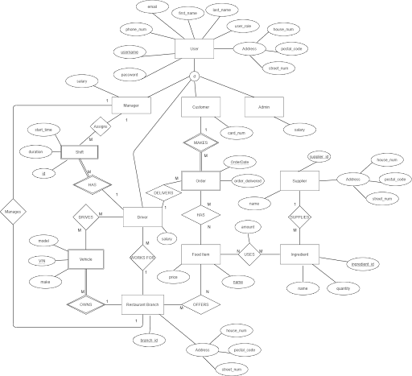
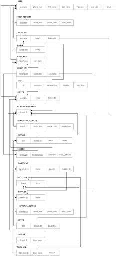

# Backend - Food Delivery Managment System

## Overview

The backend of the **Food Delivery Managment System** is built using **Python** and the **Django Framework**, supported by the **Django Rest Framework (DRF)** for robust API development. It serves as the core of the application, handling user authentication, order processing, and data management to ensure smooth functionality for Managers, Drivers, and Customers.

---

## Prerequisites

Before running the backend, ensure the following tools are installed on your system:

1. **Python 3.7 or greater**  
   [Download Python](https://www.python.org/downloads/)

2. **Django**  
   [Guide to Install Django](https://developer.mozilla.org/en-US/docs/Learn/Server-side/Django/development_environment)

3. **Docker & Docker Compose**  
   [Install Docker](https://docs.docker.com/get-docker/)

---

## Setup Instructions

### Running the Backend with Docker Compose

A `docker-compose.yml` file is included to streamline deployment and containerize the backend. Follow these steps to set up and run the backend:

1. Navigate to the directory containing the `docker-compose.yml` file.
2. Run the following command to build and start the services:
   ```bash
   docker-compose up --build
   ```
3. The backend will be available at [http://localhost:8000/restapi](http://localhost:8000/restapi).

---

### Manual Setup (Optional)

If you prefer to run the backend without Docker Compose, follow these steps:

1. **Install Dependencies**
   Navigate to the `djangobackend` folder in your terminal and run:
   ```bash
   pip install -r requirements.txt
   ```

2. **Database Setup**
   To set up the database, perform the following commands:
   ```bash
   python manage.py makemigrations
   python manage.py migrate
   ```

3. **Start the Backend Server**
   Run the development server with:
   ```bash
   python manage.py runserver
   ```
   Once the server is running, navigate to [http://localhost:8000/restapi](http://localhost:8000/restapi) to ensure the backend is operational.

4. **Create a Superuser (Optional)**
   To access the Django admin panel and create mock data, you can create a superuser by running:
   ```bash
   python manage.py createsuperuser
   ```
   Navigate to [http://localhost:8000/admin](http://localhost:8000/admin) to log in with the superuser credentials.

---

## Entity Relationship Diagram (ERD)

The components of each entity can be further demonstrated by utilizing the following **Entity Relationship Diagram (ERD):**




---

## Implementation

### Relational Model

The following relational model corresponds with the entity relationship diagram to further demonstrate the attributes and relationships within the application:



---

## API Documentation

The API is documented using Postman. You can find detailed documentation for all available endpoints at the following link:  
[Postman API Documentation](https://documenter.getpostman.com/view/15386634/TzJpjLAX)

---

## Key Endpoints

The backend exposes a RESTful API for interaction with the frontend. Some of the main functionalities include:
- User authentication
- Order processing
- Shift and inventory management

For detailed information about the API endpoints, refer to the Postman documentation linked above.

---

## Development Tools and Frameworks Used
- **Django Framework**: For backend development and server-side operations.
- **Django Rest Framework (DRF)**: For building flexible and scalable RESTful APIs.
- **Docker**: For containerization and consistent deployment.
- **Docker Compose**: For orchestrating backend services.
- **SQLite (default)**: As the development database.

---
