# Frontend - Food Delivery Managment System

## Overview

The frontend of the **Food Delivery Managment System** is built using **React** and **JavaScript** to provide an intuitive and user-friendly interface for Managers, Drivers, and Customers. It integrates seamlessly with the backend APIs to enable efficient management of orders, shifts, and customer interactions.

---

## Prerequisites

Before running the frontend, ensure the following tools are installed on your system:

1. **Node.js** (Version 14 or greater recommended)  
   [Download Node.js](https://nodejs.org/en/download/)

---

## Setup Instructions

1. **Navigate to the Frontend Directory**  
   Use the terminal to navigate to the frontend folder of the project.

2. **Install Node Modules**  
   Run the following command in the terminal to install the required modules:
   ```bash
   npm install
   ```
   This will create a `node_modules` folder and populate it with all the dependencies listed in the `package.json` file.

3. **Start the Frontend**  
   Launch the frontend development server with:
   ```bash
   npm start
   ```
   The application will be available at [http://localhost:3000](http://localhost:3000).

---

## Frontend Navigation

### Login Page
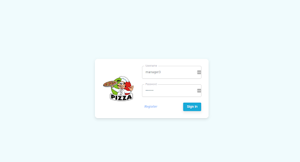

- Navigate to [http://localhost:3000](http://localhost:3000) to access the login page.
- Enter credentials to log in as either a **Manager**, **Driver**, or **Customer**.
- Alternatively, register as a customer by clicking the **Register** button and providing the necessary information.

---

### Manager Dashboard
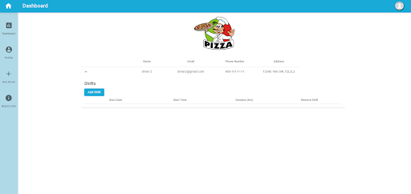

- **View Drivers**: Displays a list of drivers associated with the branch.
- **Manage Shifts**:
  - Add shifts for drivers using the dropdown.
  - Remove shifts as needed.
- **Hire Drivers**:
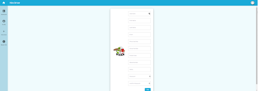
  - Click the **plus button** (Hire Driver) on the sidebar to navigate to the hiring page.
  - Enter driver details to hire a new driver.
  - After hiring, you will be redirected back to the dashboard.
- **Profile and Branch Information**:
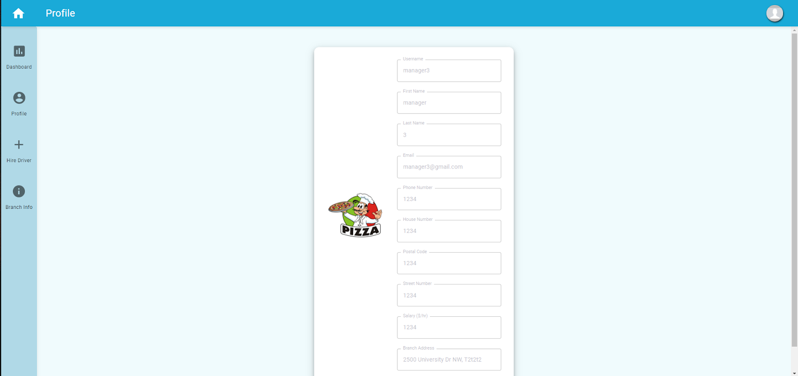
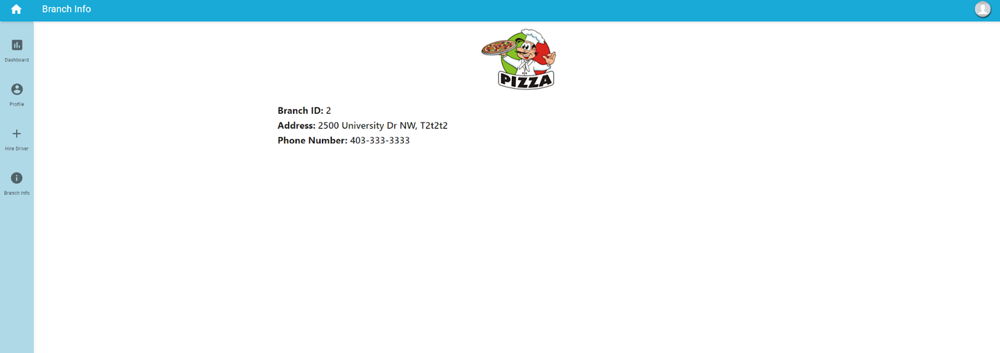
  - Access the manager’s profile and branch details via the sidebar buttons.
- **Logout**: Click the avatar icon in the top-right corner to log out.

---

### Customer Dashboard
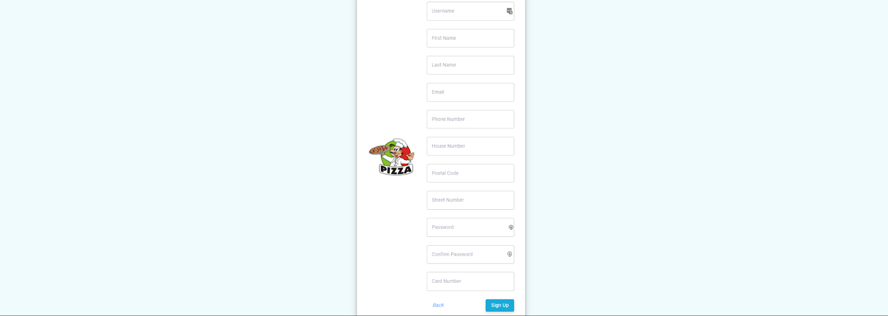

- **View Food Items**:
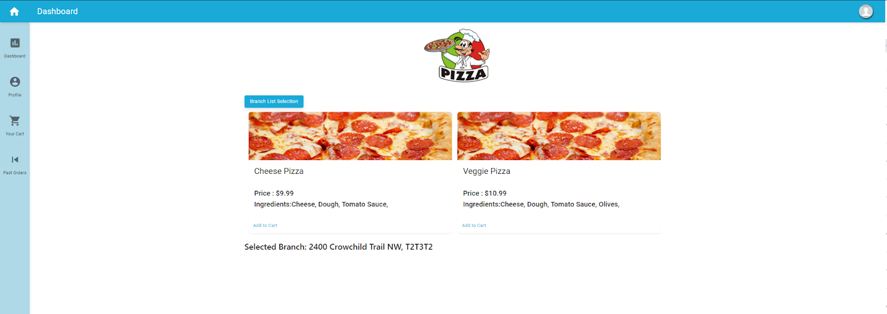

  - Select a branch from the dropdown to display its menu.
  - Add food items to your cart (Note: Changing branches clears your cart).
- **Cart**:
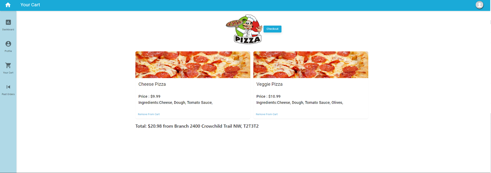
  - Access the cart via the **Cart Icon** in the sidebar.
  - View, modify, or remove items from the cart.
  - **Checkout**:
    - If drivers are available, your order will be processed and the cart cleared.
    - If no drivers are available, you will be notified, and the cart remains unchanged.
- **Past Orders**:
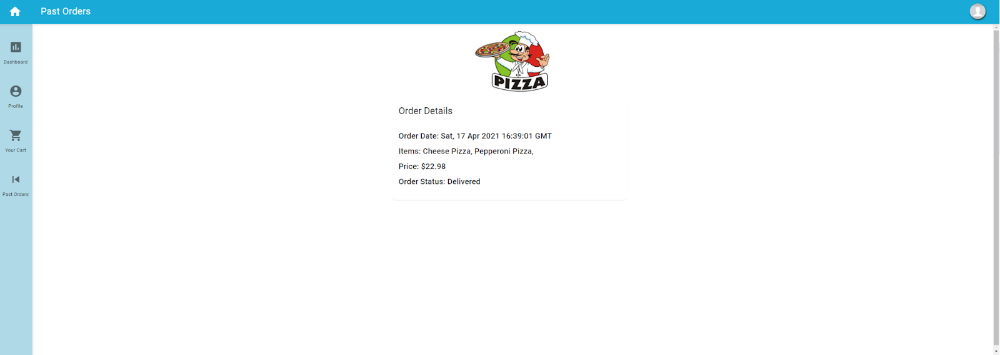
  - View the status of previous orders via the **Past Orders** button on the sidebar.
- **Profile**:
  - Update personal information through the profile page.

---

### Driver Dashboard
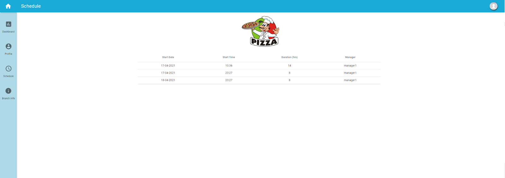

- **Schedule**:
  - View upcoming shifts by clicking the **Schedule** button in the sidebar.
- **Orders**:
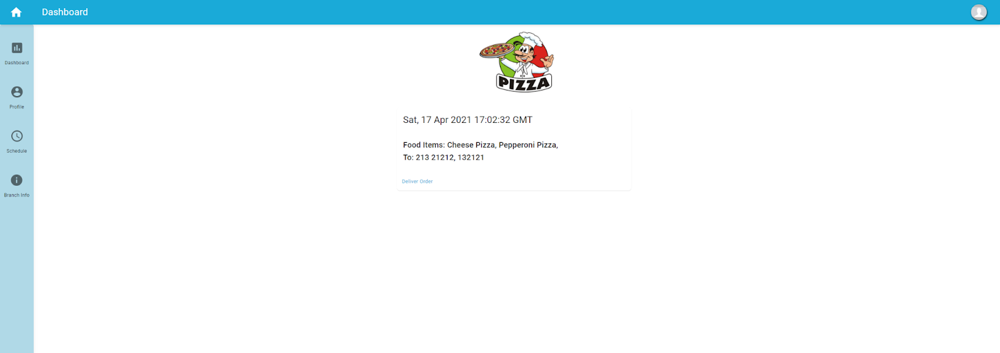
  - Access a list of orders assigned to the driver.
  - Mark orders as delivered using the **Deliver** button.
- **Profile and Branch Information**:
  - View the driver’s profile and branch details via the sidebar buttons.
- **Logout**:
  - Log out by clicking the avatar icon in the top-right corner.

---

## Features by User Role

### Manager
- Manage drivers and shifts.
- View profile and branch information.
- Hire new drivers.

### Customer
- Explore food items by branch.
- Add items to the cart and place orders.
- View past orders and update profile details.

### Driver
- View assigned shifts and orders.
- Mark orders as delivered.
- Access profile and branch details.

---

## Development Tools and Frameworks Used
- **React**: For building the user interface.
- **JavaScript**: For client-side functionality and logic.
- **HTML/CSS**: For styling and layout.
- **Node Modules**: Installed via `npm install` to manage project dependencies.

---
